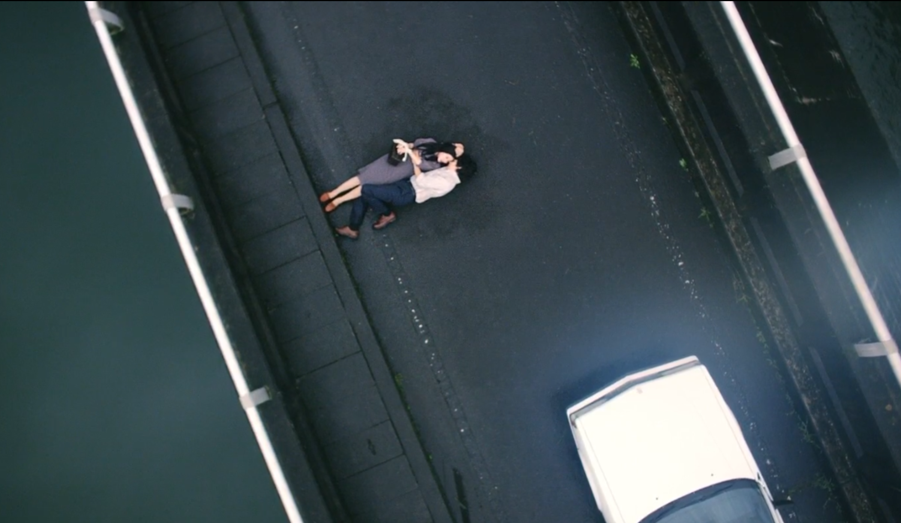

<h3 id="title">유리고코로 / ユリゴコロ</h3>

*****

개봉: 2017년 9월 23일

감독: 쿠마자와 나오토

주연: 요리타카 유리고, 마츠자카 토리, 마츠야마 켄이치

*****

<blockquote id="description">"산장 레스토랑을 경영하는 료스케의 연인이 실종된다. 췌장암에 걸린 아버지를 보러 간 료스케는 공책에 적힌 글을 읽는다. 아무런 죄의식 없이 어렸을 때부터 살인을 저지른 여인의 이야기. 인간의 본성이란 과연 무엇인지 질문하면서, 지극히 슬픈 로맨스와 살인극을 절묘하게 엮은 영화."</blockquote>

<iframe 
    id="trailer"
    width="560" 
    height="315"
    src="https://www.youtube.com/embed/y4byJWhlA4Q" 
    frameborder="0" 
    allow="autoplay; encrypted-media;" 
    allowfullscreen>
</iframe>

*****

### 줄거리

영화속에서 나오는 미츠코는 사람들이 흔히 말하는 사이코패스의 모습을 보여준다. 무감정에 공감 능력이 떨어지고 자기가 하는 행동들에 있어 양심의 가책을 느끼지 않는다. 적어도 어떤 한사람을 만나기 전까지는..

어릴때부터 무감정에 표정 변화도 없던 그녀를 걱정한 어머니는 그녀를 데리고 정신과 의사를 찾아간다. 그리고 그 곳에서 정신과 의사와 어머니의 대화를 몰래 옆에서 듣게 되었는데, 그때 의사가 "그녀에게는 '유리고코로' 가 없는 거 같다" 라는 말을 한다. 아마 이때 그녀는 '요리고코로'(안식처) 라는 말을 '유리고코로' 라고 잘못들었던 걸로 생각된다. 그리고 그 후로부터 그녀는 자신의 유리고코로를 찾아다니게 되는데, 처음 찾은 유리고코르는 작은 인형이었다. 그녀는 그 '유리고코로' 덕분에 그래도 사람들과 대화를 할 수 있는 사람이 되었다.

그리고 시간이 자나 초등학생이 되었을 무렵, 친구의 생일파티에 초대되어 가게된 그녀는 사람들과 어울리지 않고 혼자 친구집 뒷뜰에서 놀게 된다. 그리고 그 곳에서 새로운 '유리고코로' 를 찾게되는데, 그것은 우물을 덮어놓은 뚜껑의 작은 구멍 사이로 여러 살아있는 곤충 또는 벌레들을 넣는 것이었다. 하지만 그러던 와중에 모든 친구들이 집에 가고 초대를 한 친구가 와서 이제 다들 갔다고 얘기를 하는데, 그때 그녀는 모자속에 담아놓은 개구리를 친구에게 보여주고, 친구는 깜짝 놀라 뒤로 넘어지는데, 그 곳은 호수였다. 물속에 빠져 허우적 거리며 살려달라는 친구를 지켜보기만 하던 그녀는 이윽고 친구가 익사하자 새로운 '유리고코로' 를 느끼게 된다.

### 개연성은 부족하지만 충분히 독자를 매료시킬 만한 수작

처음 이 영화를 접하게 된 것은 볼만한 일본 영화가 없을까 하고 찾아보다가 우연히 포스터를 보고 끌려 보게 되었다. 포스터만 보면 마치 한여인과 두남자의 삼각관계를 진지하게 그려낸 스릴러 드라마 같지만, 왠걸 보기 시작하게 될 때부터 나의 생각이 완전 틀렸다는 것을 알게되었다. ~~그래도 전체적으로 보면 스릴러 드라마는 맞다~~

솔직히 영화 초반부에 미츠코가 한 행동들은 (초등학생 및 요리사 살인) 결코 용서받지 못할 행동들이다. 특히 모자를 집으러 하던 초등학생을 죽인 것은. 하지만 영화 중반에 그를 만나겐 된 이후로 완전히 바뀌게 된 '유리고코로' 를 알게 되고, 정작 자신에게 기쁨과 행복을 주는 것을 알게 되었을 때, 초반에 미츠코가 저지른 살인들은 그녀의 발목을 붙잡게 된다. 그리고 난 생각을 하게되었다. 만약 내가 정말 사랑하던 사람이 사실은 예전에 나를 지옥에 빠뜨렸던 사람이었다면.. 그것이 의도한거 였던, 아니였던. 그럼 나는 모든 걸 용서하고 앞으로만 생각할 수 있을까? 머리로는 말도 안된다 라고 하지만 영화를 보던 때에는 그러지 못했던 거 같다.

### TBC...